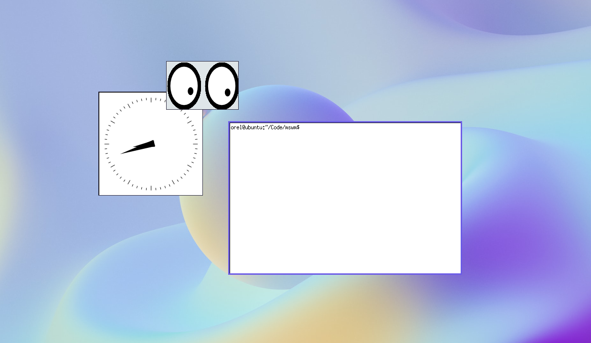

# mswm

Simple X11 Window Manager written in C++



## Usage

- **Alt + Left Click**: Move window
- **Alt + Right Click**: Resize window
- **Alt + Middle Click**: Close window

## Instructions

### Prerequisites

- C++ 11 compiler
- [GNU Make](https://www.gnu.org/software/make/)
- Xlib headers and libraries
- [google-glog](https://github.com/google/glog) library
- [Xephyr](https://www.freedesktop.org/wiki/Software/Xephyr/)
- xinit and X utilites
- [feh](https://feh.finalrewind.org/)

### Installation and Running

On Debian:

```bash
sudo apt install \
    build-essential libx11-dev libgoogle-glog-dev \
    xserver-xephyr xinit x11-apps xterm
```

Clone the repository and run `./run.sh` (set to executable if needed).
