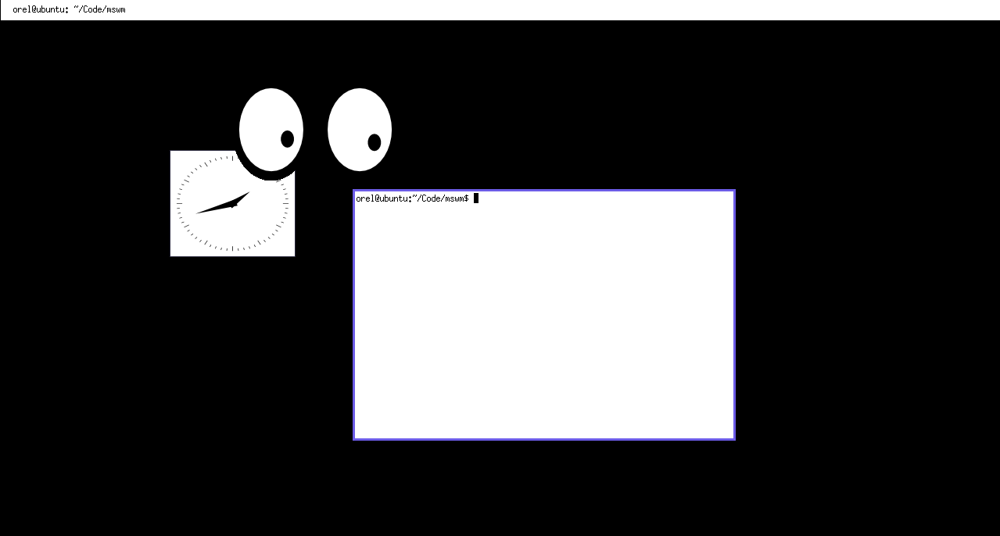

# 🪟 mswm

[Floating](https://en.wikipedia.org/wiki/Stacking_window_manager) X11 Window Manager with workspaces. Written in C++.



## Usage

| Trigger                  | Action                               |
| ------------------------ | ------------------------------------ |
| Left Click               | Focus window                         |
| Alt + Left Click         | Move window                          |
| Alt + Right Click        | Resize window                        |
| Alt + Middle Click       | Close window                         |
| Alt + Tab                | Switch active window                 |
| Alt + Shift + Enter      | Open terminal                        |
| Alt + Ctrl + Right Arrow | Switch to next workspace (or create) |
| Alt + Ctrl + Left Arrow  | Switch to previous workspace         |

## Instructions

### Prerequisites

- C++ 14 compiler
- [GNU Make](https://www.gnu.org/software/make/)
- Xlib headers and libraries
- [google-glog](https://github.com/google/glog) library
- xinit and X utilites
- [Xephyr](https://www.freedesktop.org/wiki/Software/Xephyr/) for running locally

### Installation and Running

On Debian:

```bash
sudo apt install \
    build-essential libx11-dev libgoogle-glog-dev \
    xserver-xephyr xinit x11-apps xterm
```

Clone the repository and run `./run.sh` (set to executable if needed). This will build the program and run it inside Xephyr.

**NOTE**: If running on Xephyr, disable num lock to avoid bugs.

### Build

Run `make`
